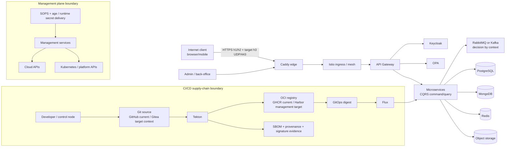

# System context et trust boundaries

Les contrôles structurants sont dans
[`governance/controls.yaml`](../../governance/controls.yaml). Cette vue applique
`SEC-002`, `IAM-001`, `NET-001`, `ARCH-003` et `SUPPLY-005`.

## Frontières

1. Internet vers Caddy : entrée non fiable, TLS obligatoire, HTTP/3 cible mais
   `NOT_PROVEN_RUNTIME`; aucun bypass de rate limit ou policy par protocole.
2. Edge vers mesh : identity service et mTLS futurs à prouver ; H3 n'est pas
   imposé east-west.
3. User/admin vers Keycloak/OPA : authn et authz séparées ; admin abuse fait
   partie du threat model.
4. Services vers state/messaging : credentials minimaux, réseau non public,
   transactions CQRS + Outbox et consumers idempotents avec retry borné/DLQ.
5. Source vers build/registry/GitOps : commit, snapshot, digest, SBOM, provenance
   et signature doivent rester liés ; Flux déploie uniquement le digest Git.
6. Management vers cloud/platform : séparation de credentials et human gates.
   Le Management backend reste `NOT_MIGRATED`.
7. Secrets : le contrat local reste hors dépôt/OneDrive ; SOPS + age est la
   cible GitOps chiffrée, sans clé réelle dans cette vue.

Les environnements ne se font aucune confiance implicite et ne partagent ni
secret, credential, PII réelle ni state.
